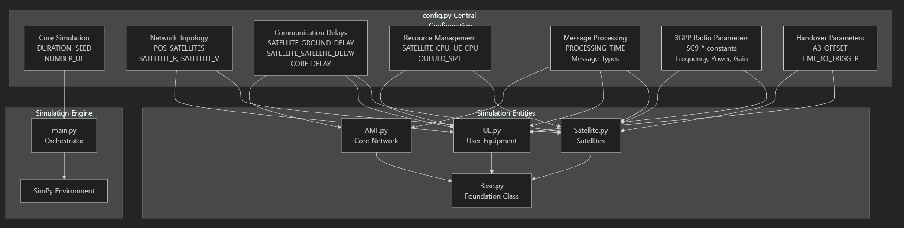

# 🛰 Satellite Network Simulator 1 (SatNetSim1)

**SatNetSim1** is a **Handover Simulator** built on the [SimPy](https://simpy.readthedocs.io/) discrete-event simulation framework in Python.  
It is designed to model **handover scenarios in Low Earth Orbit (LEO) satellite networks** with high flexibility and detailed performance metrics.  

> ⚠️ **Note:** This simulator is currently under active development and **has not been officially published**.  
> It is a **non-open-source** project — usage is strictly limited.

---

## 🚀 Key Features (including 'To Be')
- **Discrete-Event Simulation** powered by [SimPy](https://simpy.readthedocs.io/)
- **LEO Satellite Handover Modeling** for multi-satellite constellations
- **3GPP-based Handover Protocol**: Conventional/Conditional, Measurement/Location/Timer-based, RACH-less, etc.
- **Customizable Parameters** for orbital configuration, UE mobility, and link properties
- **Performance Metrics**: latency, throughput, handover success rate, and event logs
- Modular design for integration with other satellite network models

---

## 🛰 System Architecture

  

---

## 📜 Usage Restrictions
- The source code and related assets are **proprietary** and may not be redistributed, modified, or published without prior written consent.
- Access is restricted to authorized collaborators and institutions.
- Any unauthorized use, distribution, or disclosure of the code is prohibited.

---

## 📬 Contact
For inquiries regarding **SatNetSim1**, please contact:  

Jongtae Lee (Ph.D. Candidate)
Wireless Internet aNd Network Engineering Research (WINNER) Lab
Dept. of Artificial Intelligence Convergence Network
Ajou University, Suwon, Republic of Korea

- E-mail: jtlee830@ajou.ac.kr
- Phone: +82-(0)31-219-2474
- Lab Homepage: https://winner.ajou.ac.kr/
- Personal CV: https://sites.google.com/view/jongtaelee-cv/introduce

---
*© SatNetSim1 — All Rights Reserved.*
